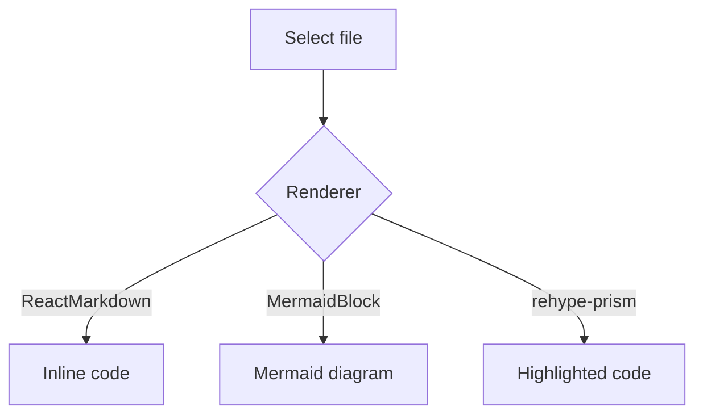

# Markdown Viewer Overview

This sample document demonstrates Markdown Viewer's ability to render **inline code** like `const x = 42;`, syntax-highlighted blocks, Mermaid diagrams, and GitHub-flavored Markdown (GFM) extensions.

## Inline code and emphasis

- Toggle backticks to verify `window.api.printDocument`.
- Combine `inline code` with _italic_ or **bold** emphasis.
- Check escaping: `` `literal backticks` `` should render correctly.

## Syntax highlighted code blocks

```ts
import { readFile } from 'node:fs/promises';

export async function loadMarkdown(path: string) {
  const raw = await readFile(path, 'utf8');
  return raw.replace(/\r\n/g, '\n');
}
```

```bash
npm run dist
electron-builder --publish never
```

## Mermaid diagram



## GitHub-flavored Markdown table

| Feature     | Status     | Notes                                |
| ----------- | ---------- | ------------------------------------ |
| Inline code | ✅ Enabled | Uses custom renderer fallbacks.      |
| Mermaid     | ✅ Enabled | Detected via `remarkMermaid`.        |
| Prism       | ✅ Enabled | `rehype-prism` tokens + custom CSS.  |
| GFM Table   | ✅ Enabled | Provided by `remark-gfm`.            |

> Tip: select Mermaid diagrams and scroll to ensure zoom handling still works.
