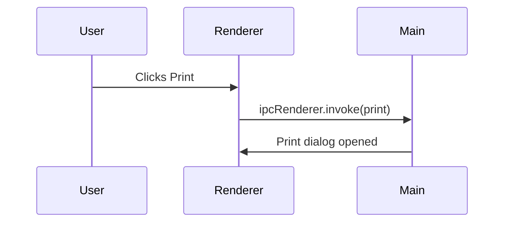

# Printing Preview Checklist

Ensure the print flow captures code styles and Mermaid diagrams.

## Steps

1. Open this file.
2. Use **Print**.
3. Confirm the print preview shows:
   - Inline code like `printStyles`.
   - Block code, tables, and Mermaid diagrams.

### Reference code (TypeScript)

```ts
type PrintPayload = {
  title: string;
  html: string;
};

async function handlePrint(payload: PrintPayload) {
  const { title, html } = payload;
  await window.api.printDocument({ title, html });
}
```

### Mermaid sequence



### Table with alignment (GFM)

| Step | Action                | Expected result        |
| ---: | --------------------- | ---------------------- |
|   1  | Load document         | Content renders fully. |
|   2  | Open Print dialog     | Inline code visible.   |
|   3  | Export to PDF         | Mermaid renders crisp. |

---

> _Reminder_: The print stylesheet sets `color-scheme: light`, so double-check contrast.
